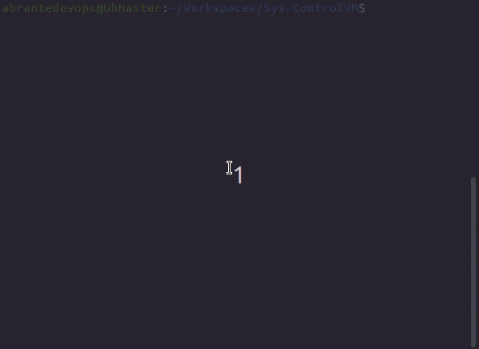

<h2> Sys-ControlVMs - Virtual machines management with libvirt </h2>

<h4 style="text-align:center;">v1.0</h4> 
<p align="center"></p>

<hr>

<h4 style="text-align:center;">v2.0</h4>
<p align="center"></p>

<hr>

Obs:
This management needs a virbr0 interface, if you don't have it, you can start it with the following command:
    <br>
```bash
sudo virsh net-define /etc/libvirt/qemu/networks/autostart/default.xml
sudo virsh net-start default
```

<hr>

<h2>Report Bugs</h2>
<p>If you notice issues while using this tool kindly mail to me at <a href="mailto:thiago.souza@see.pb.gov.br">see.pb.gov.br</a> or open an issue on GitHub.</p>
    